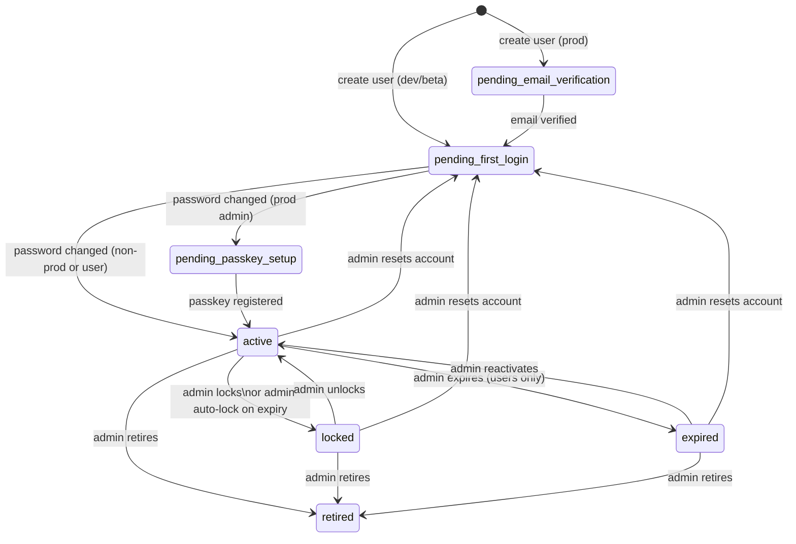

# User State Model

This document describes all user account states, their transitions, and the rules governing them. It is the authoritative reference for account lifecycle behaviour.

See also: [SPECIFICATION.md](SPECIFICATION.md) for the full system specification.

## States

| Status | Who | Can login? | Can write? | Description |
|--------|-----|-----------|-----------|-------------|
| `pending_email_verification` | Users (prod only) | No | No | Account created; awaiting email verification link click. Token expires after 7 days. |
| `pending_first_login` | All | Yes (OTP only) | No | Account exists with one-time password. Must change password on first login. |
| `pending_passkey_setup` | Admins (prod only) | Yes | No | Password set; must register a WebAuthn passkey before gaining full access. |
| `active` | All | Yes | Yes | Fully onboarded. Normal operation. |
| `locked` | All | No | No | Account suspended. Returns `ACCOUNT_SUSPENDED` (403) on login attempt. |
| `expired` | Users only | Yes | No (read-only) | Can view vaults but cannot create, update, or delete items. Shown an expiration dialog on login. |
| `retired` | All | No | No | Username renamed to `_retired_{userId}_{original}`. Appears non-existent. |

## State Diagram

## Transition Rules

### Account Creation

| Trigger | From | To | Conditions |
|---------|------|----|------------|
| Admin creates user (prod + SES) | — | `pending_email_verification` | Registration token generated (7-day expiry) |
| Admin creates user (dev/beta) | — | `pending_first_login` | OTP generated, printed or emailed |
| `init-admin.ts` | — | `pending_first_login` | Bootstrap admin, OTP printed to console |

### Onboarding

| Trigger | From | To | Conditions |
|---------|------|----|------------|
| User clicks email verification link | `pending_email_verification` | `pending_first_login` | Token valid and not expired |
| User logs in with OTP and sets password | `pending_first_login` | `active` | Non-prod environment, or regular user |
| Admin logs in with OTP and sets password (prod) | `pending_first_login` | `pending_passkey_setup` | Prod environment, admin role, `passkeyRequired: true` |
| Admin registers passkey | `pending_passkey_setup` | `active` | At least one passkey registered |

### Admin Actions

| Trigger | From | To | Who can do it | Constraints |
|---------|------|----|---------------|-------------|
| Lock user | `active` | `locked` | Any admin | Cannot lock self |
| Unlock user | `locked` | `active` | Any admin | Cannot unlock self. Cannot unlock admin past expiration date (must extend expiry first) |
| Expire user | `active`, `locked` | `expired` | Any admin | **Users only** — admin accounts cannot be expired |
| Reactivate user | `expired` | `active` | Any admin | **Users only** — admin accounts cannot be reactivated (use unlock) |
| Retire user | any except `retired` | `retired` | Any admin | Cannot retire self. Username renamed. Irreversible. |
| Reset account | any except `retired` | `pending_first_login` | Any admin | Cannot reset self. Clears password, passkeys, generates new OTP. |

### Admin Account Expiration (auto-lock)

Admin accounts do **not** use the `expired` status. Instead:

1. Another admin sets an expiration date on the admin account (via profile edit)
2. When the expiration date passes and the admin attempts to log in, the system **automatically sets status to `locked`** and returns `ACCOUNT_EXPIRED`
3. To restore access, another admin must:
   - First extend the expiration date to a future date (or set to perpetual)
   - Then unlock the account
4. Attempting to unlock an admin past their expiration date returns an error

This ensures admin accounts are either fully operational or fully locked — never in a degraded read-only state.

### Self-Modification Prevention

Admins **cannot** perform the following actions on their own account:
- Lock, unlock, expire, retire, reset
- Change their own plan or expiration date

This prevents accidental self-lockout and privilege escalation. The `init-admin.ts --force` script serves as an emergency recovery path.

## Brute-Force Lockout (`lockedUntil`)

Distinct from the admin-set `locked` status:

| Field | Purpose | Duration | Auto-resolve |
|-------|---------|----------|-------------|
| `status: 'locked'` | Admin-imposed suspension | Indefinite | No — requires admin unlock |
| `lockedUntil` (timestamp) | Brute-force protection | 15 minutes | Yes — auto-expires |

After **5 consecutive failed login attempts**, `lockedUntil` is set to 15 minutes in the future. Login returns `ACCOUNT_LOCKED` (429) until the timestamp passes. Resets to 0 on successful login.

Both mechanisms are checked during login. A user can be both admin-locked AND brute-force locked.

## Email Change Pending State

When a user requests an email change on beta/prod:
- `pendingEmail` is set on the user record
- `emailChangeToken` (24h expiry) and `emailChangeLockToken` (1h expiry) are generated
- The user's status does **not** change — they remain `active`
- If the old email owner clicks the lock link, status transitions to `locked`
- If the verification succeeds, `username` is updated and pending fields are cleared

On dev, email changes are immediate with no pending state.

## Plan and Role Sync

| Plan | Role | Notes |
|------|------|-------|
| `free` | `user` | 1 vault limit |
| `pro` | `user` | 10 vault limit |
| `administrator` | `admin` | 10 vault limit, full admin access |

Changing a user's plan automatically syncs their role:
- Upgrading to `administrator` sets `role: 'admin'`
- Downgrading from `administrator` sets `role: 'user'` (revokes admin access)
